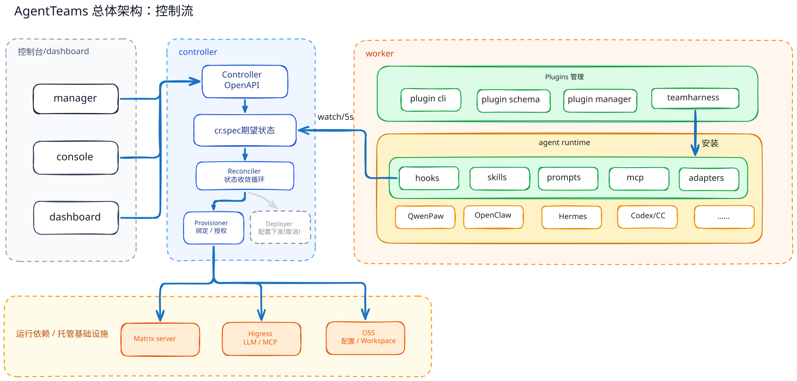
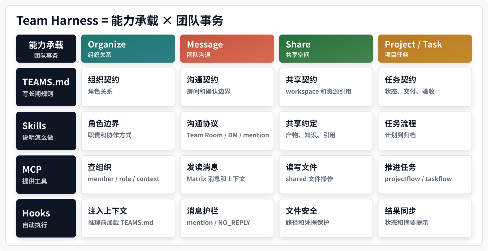

# Plugin 与 TeamHarness 设计方案

> Status: Draft proposal for community discussion.
>
> Scope: This document proposes the Plugin / TeamHarness architecture boundary
> and does not include implementation changes.

## 1. 核心概念

HiClaw 的新边界可以拆成两层：

- **Plugin 框架**：负责插件的声明、打包、安装、配置和 runtime adapter。
- **TeamHarness 插件**：HiClaw 官方默认的团队运行态插件，负责把 team-level harness 注入不同 agent runtime。

可以用一个更形象的类比理解：插件管理机制像“挽具商场”，负责陈列、打包、安装、升级和卸载不同 runtime 可用的挽具。TeamHarness 插件就是其中一套默认挽具；agent 加入 team 工作时，就是给自己安装这套挽具，也就是安装并加载 `teamharness` 插件。

## 2. 当前面临的问题

### 2.1 控制方式绑在 OpenClaw workspace 上

早期 HiClaw 的控制方式是：controller 把文件写进一个 OpenClaw 风格的 workspace，agent 运行时再从这些文件里读取自己的提示词、工具配置和协作规则。

这在只有 OpenClaw 时是简单有效的。但当 QwenPaw、CoPaw、Hermes 等 runtime 加进来后，它们并不天然使用 OpenClaw 的目录和配置格式，于是就需要一层 bridge：先把 controller 写出的 OpenClaw 风格文件接住，再转换成各自 runtime 真正需要的配置。

结果是新增一个 runtime 时，不只是启动方式不同，还要处理一套“OpenClaw 标准空间如何变成本 runtime 私有空间”的转换逻辑。

### 2.2 热更新链路复杂，实时性不够

agent 的配置不是一次性写完就结束。提示词、skills、MCP、模型、Matrix 房间、权限、共享目录，都可能需要在运行中同步或刷新。

旧链路里，更新一次配置可能经过好几段：

```text
controller 写文件
worker 同步文件
bridge 转换配置
runtime reload
agent 重建 prompt
```

任何一段没完成，最终表现都可能只是“agent 没按预期工作”。同时，这条链路依赖文件同步、bridge 转换和 runtime reload，更新不一定能及时进入当前会话。排查时也很难一眼看出问题发生在哪一层。

### 2.3 新 runtime 接入容易重复造轮子

不同 agent runtime 的执行方式不同，但 team 协作需要的东西大体相同：

- 知道自己在 team 里的角色；
- 能看 team 的协作规则；
- 能收发 Matrix 消息；
- 能访问 shared workspace；
- 能处理 project / task；
- 能使用基础安全护栏。

如果每个 runtime 都自己实现一遍这些能力，就会出现很多重复代码。更麻烦的是，同一件事在不同 runtime 里会慢慢变成不同规则，后续很难保持一致。

### 2.4 托管 agent 和远端 agent 接入方式不统一

HiClaw 里有两类 agent：

- 托管 agent：由 HiClaw 创建容器或 Pod，例如 qwenpaw worker。
- 远端或本地 agent：由用户自己启动，例如 Claude Code、Codex、本地 QwenPaw。

它们的启动方式不同，但加入 team 后都需要同样的团队协作能力。如果托管 agent 走一套逻辑，远端 agent 又走另一套逻辑，后续每加一种接入方式都要重新解释和实现一遍。

### 2.5 升级和发布牵一发动全身

旧模式下，哪怕只是改一段 team prompt、加一个 skill、调整一个 MCP 工具，也可能需要改 controller、manager 镜像或某个 runtime bridge。

这样会带来几个问题：

- 小的协作规则更新也要跟着控制面发版；
- 一个 runtime 的调整可能影响其它 runtime；
- 已经运行的 worker 很难只更新 harness 能力；
- 用户想接入新的本地 agent 时，需要等主系统支持。

TeamHarness 插件化后，这些团队运行态能力可以按插件打包和升级，影响面会更小。

### 2.6 Team 协作缺少统一底座

HiClaw 的 team 不是简单地启动多个 agent。一个 team 里会有 Leader、Worker、Manager、remote member，会有 Team Room、DM、任务分配、结果提交、共享文件、并行协作和安全边界。

这些规则如果散落在不同 runtime、不同 prompt、不同脚本里，就很容易不一致。TeamHarness 的作用就是把这些共同规则集中起来，成为 agent 加入 team 后都能使用的一套基础底座。

## 3. 架构

整体架构可以拆成五个层次：控制台入口、controller 收敛、worker 本地初始化、agent runtime 执行、托管基础设施。





## 4. 升级后的使用方式

### 4.1 Plugin 使用

Plugin 使用主要通过 `agentteams` CLI 完成。它面向的是“插件怎么被安装、查看、更新和卸载”，不直接等同于某个 team 的连接状态。

当前需要支持的主流命令：

```bash
agentteams plugin install <name> [--runtime NAME] [--source PATH] [--package PATH]
agentteams plugin list
agentteams plugin update <name> [--source PATH]
agentteams plugin uninstall <name>
```

典型安装方式：

```bash
agentteams plugin install teamharness \
  --runtime claude-code \
  --package dist/adapters/claude-code/teamharness-claude-code-0.1.0.zip
```

`--source` 面向本地开发，直接从 `plugins/teamharness` 安装；`--package` 面向分发，安装 adapter 构建出来的 runtime package。

### 4.2 TeamHarness 使用

TeamHarness 使用分为两类：cluster 和 remote。两者都使用同一套 TeamHarness 插件，但生命周期不同。

### 4.2.1 Cluster

cluster 模式是 HiClaw 托管 agent 的方式，适用于 controller 创建的 Manager、Leader、Worker 容器或 Pod。

cluster 路径：

```text
构建镜像
  -> 通过 agentteams plugin CLI 安装 teamharness
  -> 镜像内带好 runtime adapter 和插件资产

controller 创建 agent
  -> 注入 HICLAW_* 运行事实和凭据
  -> 通过 agentteams CLI configure 完成本地 runtime 配置
  -> runtime 启动
  -> TeamHarness plugin 同步 prompts / skills / MCP / hooks / channel
  -> worker 自治运行
```

cluster 模式下，用户不直接登录 worker 容器操作。用户主要通过 Element / Matrix 和 Manager、Leader、Worker 交互。worker 收到任务后，依靠本地 runtime、TeamHarness plugin、Matrix、shared workspace 和 controller 注入的运行事实完成自己的工作。

QwenPaw 当前 workspace 模型：

```text
HOME=/root/hiclaw-fs/agents/<worker>
QWENPAW_WORKING_DIR=$HOME/.qwenpaw
active workspace=$HOME/.qwenpaw/workspaces/default
```

`SOUL.md` 和 `AGENTS.md` 都进入 active workspace 一级目录。team-level `TEAMS.md` 位于共享空间，并通过 prompt file 引用进入 runtime。

### 4.2.2 Remote

remote 模式是用户自持 agent 环境接入 team 的方式，适用于 Claude Code、Codex、本地 QwenPaw 等。

remote 路径：

```text
用户自持 agent 环境
  -> 通过 agentteams plugin CLI 安装 teamharness

HiClaw 控制面
  -> 用户手动创建 remote worker

用户自持 agent 环境
  -> agentteams configure <team> --as remote-member
  -> runtime adapter 写入本地配置和权限
  -> TeamHarness plugin 同步 prompts / skills / MCP / hooks / channel
  -> worker 自治运行
```

remote 模式下，用户可以继续使用自己熟悉的交互方式：

```bash
agentteams plugin install teamharness \
  --runtime claude-code \
  --package dist/adapters/claude-code/teamharness-claude-code-0.1.0.zip

agentteams configure <team-name> --as remote-member
claude
```

`configure` 只负责配置、凭据和权限，不启动交互式 runtime。用户之后直接进入自己的 runtime，例如 `claude`、`codex` 或其它本地 agent。

## 5. 升级后的开发方式

### 5.1 目录改变

改造前，没有独立的插件目录。team harness 相关内容分散在 controller、manager 镜像内置 workspace 和 runtime bridge 里：

```text
hiclaw-controller/
  internal/agentconfig/              # 生成 prompt / coordination / MCP 等标准空间配置
  internal/service/                  # 写入 worker 标准空间，注入运行事实和凭据

manager/
  agent/                             # manager prompt、skills、worker/leader 模板
  scripts/init/                      # 启动时同步 builtin prompt / skills

copaw/
  src/copaw_worker/                  # bridge / sync / task / worker runtime 逻辑
```

这套结构的问题是：controller 负责生成和改写 OpenClaw 风格标准空间；manager 自带 prompt、skills 和 worker 模板；CoPaw 再把标准空间 bridge 成自己的 runtime 配置。新增 runtime 或调整 team 行为时，很容易同时改 controller、manager、worker runtime 和 bridge。

改造完成后，TeamHarness 相关内容收敛到官方默认插件目录：

```text
plugins/
  cli/                               # agentteams CLI，负责插件安装、配置、诊断
  schemas/                           # 插件 manifest schema
  scripts/                           # 插件打包、校验、构建脚本
  tests/                             # CLI 和插件集成测试

  teamharness/                       # 官方默认 Team Harness 插件
    prompts/                         # TEAMS.md、role prompt、manager workspace prompt
    skills/                          # agent / team / manager 技能
    mcp/                             # TeamHarness MCP 工具
    hooks/                           # 上下文、安全、同步等运行时切入点
    adapters/                        # QwenPaw、Claude Code、OpenClaw、Hermes 等适配
    daemon/                          # remote runtime 的 Matrix watch / bridge 能力

qwenpaw/                             # QwenPaw cluster runtime，不承载 harness 规则
  Dockerfile*
  scripts/
  src/
```

这次修改带来的核心变化：

- `TEAMS.md`、role prompt、manager workspace prompt 统一进入 `plugins/teamharness/prompts`；
- manager skills、team skills、agent skills 统一进入 `plugins/teamharness/skills`；
- runtime 差异只放在 `plugins/teamharness/adapters/<runtime>`；
- QwenPaw 目录只保留 runtime 生命周期、镜像、启动和健康检查逻辑，不硬编码 TeamHarness 内容；
- 旧 CoPaw bridge 思路不再复制到 QwenPaw，后续逐步退役。

### 5.2 开发模式

新增或修改 TeamHarness 能力时优先按以下顺序开发：

1. 更新 `plugin.yaml` 契约；
2. 更新插件集成测试；
3. 更新 runtime adapter；
4. 更新 runtime-specific package builder / validator；
5. 更新 e2e 测试。

不建议从 controller 入手新增 prompt、skill 或 MCP 逻辑。controller 只应新增资源事实、env、凭据或生命周期支持。

### 5.3 发版机制

TeamHarness 发版应该走插件包，而不是 controller 发版承载全部变更。

推荐包形态：

- raw source：`plugins/teamharness`，用于本地开发；
- runtime package：adapter 构建出来的 zip 或目录，用于用户安装；
- image artifact：托管 worker 镜像内预置 adapter package，用于 cluster worker。

例如 Claude Code remote：

```bash
plugins/teamharness/adapters/claude-code/scripts/build-claude-code-plugin.rb \
  plugins/teamharness/plugin.yaml

agentteams plugin install teamharness \
  --runtime claude-code \
  --package dist/adapters/claude-code/teamharness-claude-code-0.1.0.zip
```

例如 QwenPaw cluster：

```text
qwenpaw Docker image
  -> /opt/hiclaw/plugins/teamharness-qwenpaw
  -> qwenpaw plugin install /opt/hiclaw/plugins/teamharness-qwenpaw --force
```

## 6. Plugin 管理机制

### 6.1 Schema

TeamHarness 当前 manifest：

```yaml
apiVersion: hiclaw.agentteam/v1alpha1
kind: AgentTeamPlugin
metadata:
  name: teamharness
  version: 0.1.0
```

`apiVersion` 和 `kind` 是插件系统 schema，不等于默认插件名。即使默认插件叫 `teamharness`，schema 仍可以保留 `hiclaw.agentteam/v1alpha1` 和 `AgentTeamPlugin`。

schema 约束应覆盖：

- metadata；
- prompts；
- skills；
- mcp servers/tools；
- hooks；
- adapters；
- package include。

### 6.2 CLI

当前 CLI 入口：

```text
agentteams plugin install <name> [--runtime NAME] [--source PATH] [--package PATH]
agentteams plugin list
agentteams plugin update <name> [--source PATH]
agentteams plugin uninstall <name>

agentteams configure <team> [--as ROLE] [--from-env]
agentteams daemon start <team> [--as ROLE] [--from-env]
agentteams daemon status [team]
agentteams daemon stop [team]
agentteams status
```

CLI 是 remote/local 接入工具，不是托管 cluster worker 的启动工具。

### 6.3 Package

插件包分两类：

- **source package**：通用源码目录，包含 `plugin.yaml`、prompts、skills、mcp、hooks、adapters；
- **runtime package**：由 adapter 构建，符合某个 runtime 的原生插件格式。

`--source` 面向开发者，`--package` 面向用户分发。

### 6.4 Install / Uninstall

安装流程：

```text
agentteams plugin install
  -> 选择 runtime
  -> 定位 source 或 package
  -> 校验 manifest
  -> 调用 runtime adapter install_plugin
  -> 保存 .agentteams/plugins/<name>/manifest.json
```

卸载流程：

```text
agentteams plugin uninstall
  -> 检查依赖
  -> 调用 runtime adapter uninstall_plugin
  -> 删除 .agentteams/plugins/<name>/manifest.json
```

### 6.5 Configure

`configure` 是连接配置，不是插件安装。

职责：

- 采集或读取 Matrix 凭据；
- 校验 token；
- join Team Room；
- 保存 `.agentteams/teams/<team>/config.json` 和 `.env`；
- 调用 runtime adapter 写入权限、env、project-scope plugin 配置。

核心人工输入应尽量压缩到：

- team；
- user；
- password 或 token。

其它信息应优先从 HiClaw CLI/API、邀请链接、环境变量或 team 配置中推导。

## 7. TeamHarness 详细设计

### 7.1 与 controller 的配置协议

controller 向托管 worker 注入 `HICLAW_*` 事实。典型字段包括：

```text
HICLAW_AGENT_NAME
HICLAW_AGENT_ROLE
HICLAW_AGENT_HOME
HICLAW_WORKER_NAME
HICLAW_WORKER_CR_NAME
HICLAW_WORKER_ROLE
HICLAW_WORKER_HOME
HICLAW_TEAM_NAME
HICLAW_TEAM_STORAGE_ID
HICLAW_TEAM_ROOM_ID
HICLAW_TEAM_LEADER_NAME
HICLAW_MATRIX_URL
HICLAW_MATRIX_DOMAIN
HICLAW_WORKER_MATRIX_TOKEN
HICLAW_FS_ENDPOINT
HICLAW_FS_BUCKET
HICLAW_FS_ACCESS_KEY
HICLAW_FS_SECRET_KEY
HICLAW_AI_GATEWAY_URL
HICLAW_WORKER_GATEWAY_KEY
HICLAW_DEFAULT_MODEL
HICLAW_CHANNEL_POLICY_JSON
```

controller 不直接注入旧 `AGENTTEAM_TEAM_ROOM_ID`、`AGENTTEAM_TEAM_STORAGE_ID` 等 team fact。`AGENTTEAM_*` 可以作为 runtime/plugin 内部 env 使用，例如：

```text
AGENTTEAM_ROLE
AGENTTEAM_TARGET_AGENTS
AGENTTEAM_WORKSPACE_DIR
AGENTTEAM_SYNC_INTERVAL_SECONDS
```

对于 QwenPaw，entrypoint / worker 会设置内部运行所需的 `AGENTTEAM_*`，但 controller 只提供 `HICLAW_*`。

### 7.2 Prompts

Prompt 分层：

```text
shared/TEAMS.md              team-level 协作契约
workspace/AGENTS.md          agent role prompt
workspace/SOUL.md            当前 agent identity，由 controller/manager 显式提供
workspace/TOOLS.md           manager 工具边界
workspace/HEARTBEAT.md       manager heartbeat 行为
```

QwenPaw 现态：

```text
worker home=/root/hiclaw-fs/agents/<name>
qwenpaw runtime=$HOME/.qwenpaw
active workspace=$HOME/.qwenpaw/workspaces/default

$HOME/SOUL.md
  -> copied to $HOME/.qwenpaw/workspaces/default/SOUL.md

TeamHarness worker role prompt
  -> $HOME/.qwenpaw/workspaces/default/AGENTS.md

shared/TEAMS.md
  -> /root/hiclaw-fs/shared/TEAMS.md
  -> referenced by QwenPaw system_prompt_files
```

`TEAMS.md` 不再混入 worker role prompt。Team context hook 只生成 team-level context；role prompt 进入 `AGENTS.md`。

### 7.3 Skills

Skills 分三组：

- `skills/agent`：基础 agent 能力，例如 mcporter、find-skills、config-sync；
- `skills/team`：团队协作能力，例如 organization、communication、file-sharing、taskflow；
- `skills/manager`：Manager 管理能力，例如 worker-management、team-management、human-management、model-switch、mcp-server-management。

Team member runtime 按 role 过滤 skills：

- leader：组织、沟通、文件、项目管理、任务分配、团队协调；
- worker：组织、沟通、文件、任务执行；
- remote-member：组织、沟通、文件、任务执行；
- manager：管理面 skills + 必要的基础工具。

### 7.4 MCP

TeamHarness 内置 stdio MCP server：

```text
plugins/teamharness/mcp/server.py
```

当前工具：

- `health`
- `message`
- `filesync`
- `runtimehealth`
- `projectflow`
- `taskflow`

MCP 工具定位：

- 提供结构化团队操作；
- 支持跨 room、跨 session、跨成员的主动消息；
- 支持 shared workspace / project / task 操作；
- 提供 runtime health 和诊断。

Matrix native channel 与 MCP message tool 不互相替代：

- native channel 负责当前 session 的收消息、thread/session/default reply；
- MCP message tool 负责主动跨 session、跨房间、跨成员发消息。

### 7.5 Hooks

Hook 不使用二级目录，全部平铺在 `hooks/`。触发时机和关注维度写在 manifest。

当前标准触发时机：

| Trigger | 含义 |
| --- | --- |
| `runtimeStart` | runtime 启动后同步 |
| `periodic` | 周期同步 |
| `manual` | 手动同步 |
| `sessionStart` | 新会话开始 |
| `preReasoning` | 推理前 |
| `preToolUse` | 工具调用前 |
| `postToolUse` | 工具调用后 |
| `preSend` | 发送消息前 |
| `postReceive` | 收到消息后 |

当前标准关注维度：

| Concern | 含义 |
| --- | --- |
| `context` | prompt/context 同步 |
| `organization` | team / member 组织关系 |
| `skills` | skill 安装和过滤 |
| `mcp` | MCP client/server |
| `message` | Matrix / channel / routing |
| `security` | 凭据保护、输出脱敏 |
| `diagnostics` | health/status |
| `contextOptimization` | 上下文裁剪和重建 |

当前 hooks：

| Hook | Triggers | Concerns |
| --- | --- | --- |
| `sync` | `runtimeStart`, `periodic`, `manual` | `context`, `skills`, `mcp`, `message`, `diagnostics` |
| `team-context` | `sessionStart`, `preReasoning` | `context`, `organization`, `contextOptimization` |
| `credential-guard` | `preToolUse` | `security` |
| `output-sanitizer` | `postToolUse`, `preSend` | `security` |
| `message-route` | `postReceive` | `message`, `organization` |

### 7.6 Adapters

Adapter 是 runtime 差异层。它把通用 TeamHarness 插件转换成 runtime 能安装、能运行的形态。

当前 adapter：

- `qwenpaw`
- `claude-code`
- `openclaw`
- `hermes`

QwenPaw adapter 当前职责：

- 安装 plugin 到 QwenPaw 原生 plugin 目录；
- 写 default agent workspace；
- 写 `AGENTS.md`、`SOUL.md`、shared `TEAMS.md` 引用；
- 安装 role skills；
- 写 MCP client；
- 写 Matrix channel；
- 写 model provider；
- 注册 `/api/teamharness/health/status/sync`；
- 包装 toolkit / matrix send 实现安全 hook。

Claude Code adapter 当前职责：

- 构建 Claude Code plugin package；
- 安装到 `.claude/skills/teamharness`；
- 写 Claude plugin manifest、hooks、monitors、MCP config；
- 通过 `agentteams configure` 写 project-scope 权限和本地 env。

### 7.7 Daemon

daemon 面向没有原生 Matrix channel 或需要无人值守的 local/remote runtime。

当前已有两个基础脚本：

```text
plugins/teamharness/daemon/watch-matrix.py
plugins/teamharness/daemon/stream-to-matrix.py
```

职责拆分：

- `watch-matrix.py`：Matrix inbound，监听 Team Room，识别 mention / task event；
- `stream-to-matrix.py`：runtime outbound，把 non-interactive runtime 的输出流转发到 Matrix；
- `agentteams daemon`：管理后台进程、pid、日志、状态和任务执行。

daemon 是“人的代替”，不是 interactive runtime 的替代。交互式 Claude Code 仍然由用户运行 `claude`；daemon 模式才由 CLI 后台 watch Matrix 并启动 runtime 执行任务。
